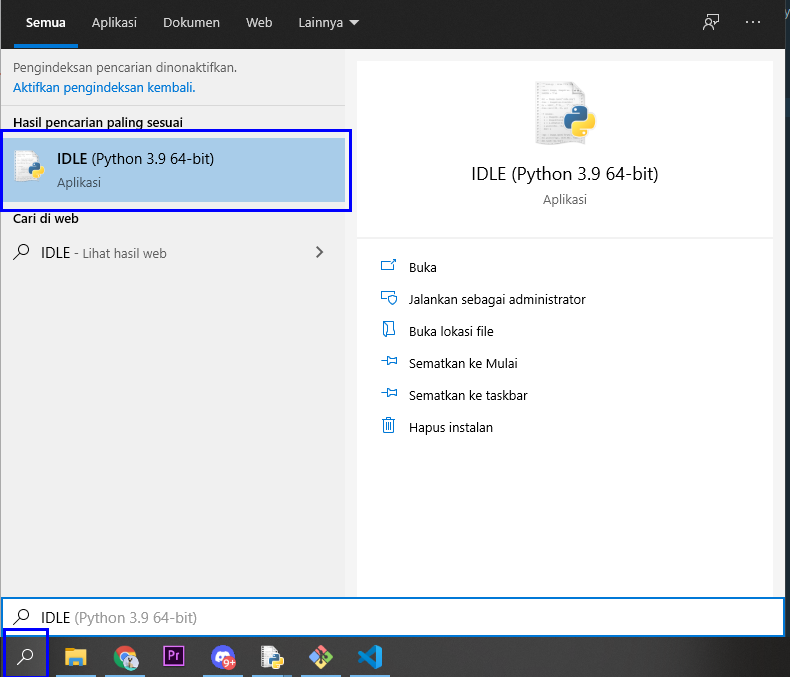
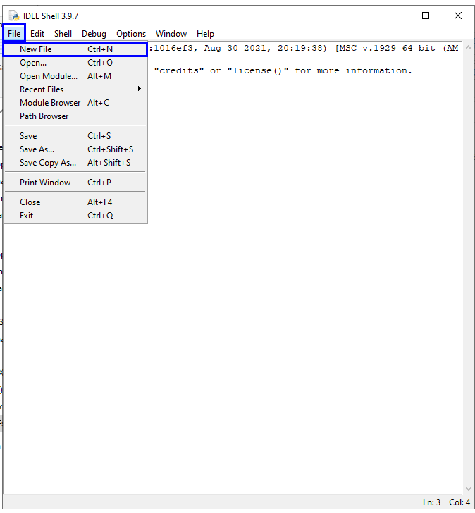
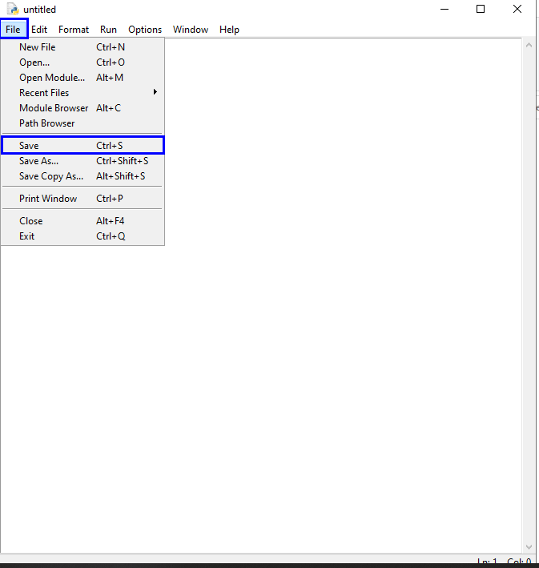
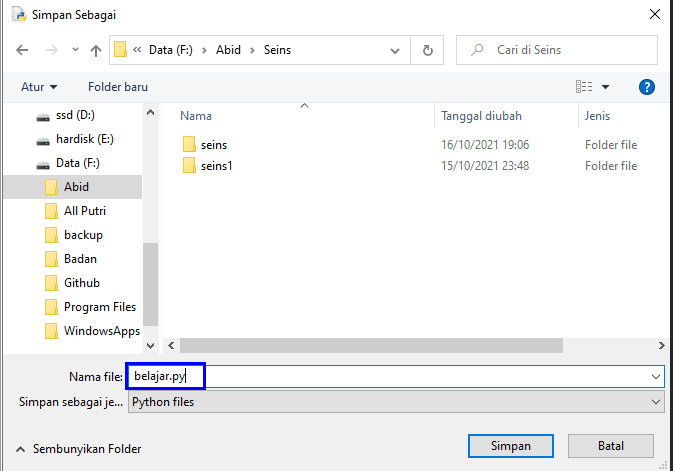
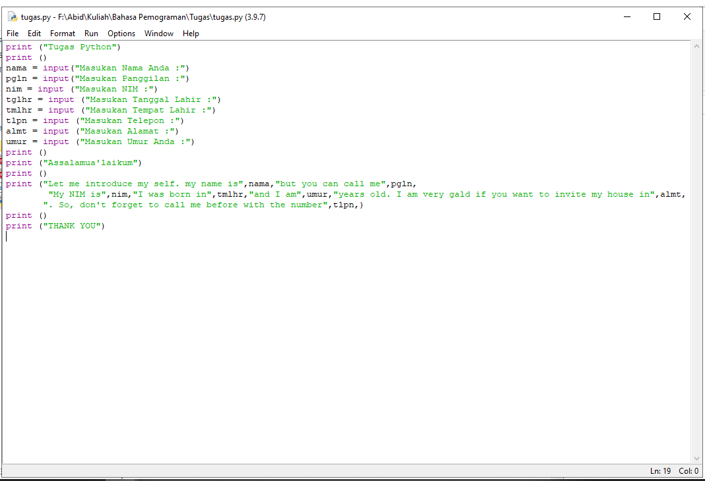
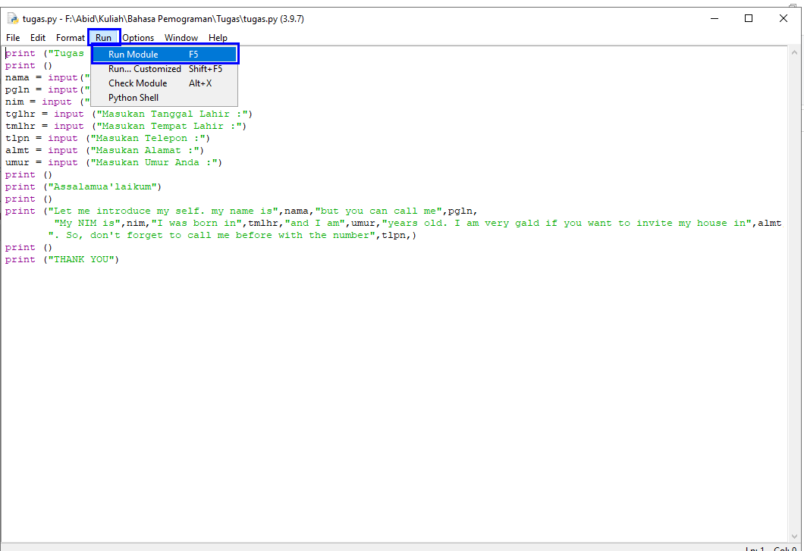

# Belajar-Python
## Cara Input Menggunakan Python

- buka IDLE Python di pencarian

- Klik (File - New File)

- Setelah itu Klik (File - Save)

- Lalu pilih tempat untuk menyimpan file Python "JANGAN LUPA MENGGUNAKAN .py"

- Koding sesuai apa yang kalian mau

- Setelah selesai koding, lalu pilih (Run - Run Module) untuk menjalankan program

- SELESAI 
## Selamat Mencoba
## Terima Kasih :)
